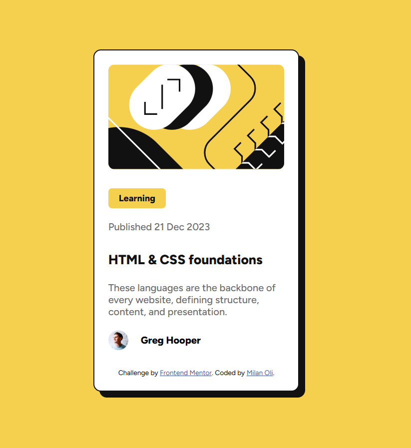

# Frontend Mentor - Blog preview card solution

This is a solution to the [Blog preview card challenge on Frontend Mentor](https://www.frontendmentor.io/challenges/blog-preview-card-ckPaj01IcS). Frontend Mentor challenges help you improve your coding skills by building realistic projects.

## Table of contents

- [Overview](#overview)
  - [The challenge](#the-challenge)
  - [Screenshot](#screenshot)
  - [Links](#links)
- [My process](#my-process)
  - [Built with](#built-with)
  - [What I learned](#what-i-learned)
  - [Continued development](#continued-development)
  - [AI Collaboration](#ai-collaboration)
- [Author](#author)

## Overview

### The challenge

Users should be able to:

- See hover and focus states for all interactive elements on the page

### Screenshot



### Links

- Repository URL: [github.com/milan-oli/frontend-projects/tree/main/blog-preview-card-main](https://github.com/milan-oli/frontend-projects/tree/main/blog-preview-card-main)
- Live Site URL: [milan-oli.github.io/frontend-projects/blog-preview-card-main/](https://milan-oli.github.io/frontend-projects/blog-preview-card-main/)

## My process

### Built with

- Semantic HTML5 markup
- CSS custom properties
- Flexbox
- Mobile-first workflow
- Google Fonts (Figtree)

### What I learned

This project's brief explicitly required hover and focus states for interactive elements, which pushed me to think more carefully about accessibility than in my last project.

The main thing I learned was that not every element that *looks* interactive is actually focusable by default. I originally styled the card title as a plain `<h1>` with a `:hover` effect, but a keyboard user tabbing through the page would never be able to reach it. The fix was to wrap the title text in an `<a>` tag so it's a real, focusable link, then add matching styles for both states:

```css
h1 a:hover,
h1 a:focus {
  color: var(--primary-yellow);
  cursor: pointer;
}
```

I also learned to be more careful about matching a style guide exactly rather than guessing. The font weights had to be either 500 or 800 — nothing else — so I had to go back and explicitly set `font-weight: 500` on my paragraph text, since without it the browser was defaulting to 400.

Lastly, I learned that a "Learning" tag that isn't clickable shouldn't be marked up as a `<button>`. I initially used one out of habit, then swapped it for a `<span>` once I realized it was misleading users into thinking it did something.

### Continued development

- Get more practice with CSS Grid, since this project only used Flexbox
- Build more projects that require hover/focus states so accessible interactive patterns become second nature
- Keep double-checking style guides for exact values (font weights, spacing) instead of eyeballing them

### AI Collaboration

I used Claude (Anthropic) throughout this project.

- **How I used it**: I wrote all the HTML and CSS myself, then shared it with Claude for review against the design mockup and style guide.
- **What it helped with**: catching the non-focusable title link, the missing `font-weight` on paragraph text, and the misuse of `<button>` for a non-interactive tag — all accessibility/semantics issues I wouldn't have noticed on my own at this stage.
- **What worked well**: reviewing code after I wrote it, rather than having it generated for me, meant I still had to understand and apply each fix myself.

## Author

- GitHub - [@milan-oli](https://github.com/milan-oli)
- Frontend Mentor - [@milan-oli](https://www.frontendmentor.io/profile/milan-oli)
