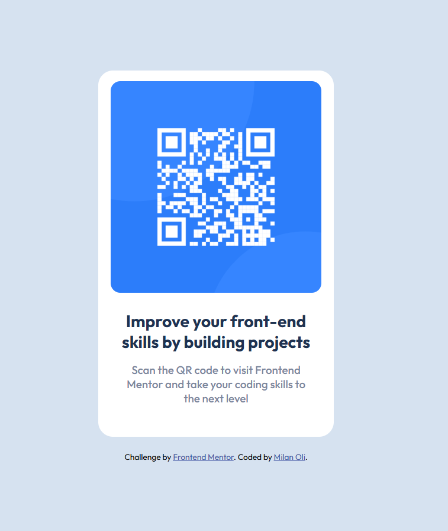

# Frontend Mentor - QR code component solution

This is a solution to the [QR code component challenge on Frontend Mentor](https://www.frontendmentor.io/challenges/qr-code-component-iux_sIO_H). Frontend Mentor challenges help you improve your coding skills by building realistic projects.

## Table of contents

- [Overview](#overview)
  - [Screenshot](#screenshot)
  - [Links](#links)
- [My process](#my-process)
  - [Built with](#built-with)
  - [What I learned](#what-i-learned)
  - [Continued development](#continued-development)
  - [AI Collaboration](#ai-collaboration)
- [Author](#author)

## Overview

### Screenshot



### Links

- Repository URL: [github.com/milan-oli/frontend-projects/tree/main/qr-code-component-main](https://github.com/milan-oli/frontend-projects/tree/main/qr-code-component-main)
- Live Site URL: [milan-oli.github.io/frontend-projects/qr-code-component-main/](https://milan-oli.github.io/Frontend-projects/qr-code-component-main/)

## My process

### Built with

- Semantic HTML5 markup
- CSS3 (Flexbox)
- Mobile-first, non-shifting card layout
- Google Fonts (Outfit)

### What I learned

This was my first Frontend Mentor challenge, so the focus was on matching a design mockup as closely as possible rather than learning new layout techniques.

Centering the card on the page with Flexbox:

```css
body {
  min-height: 100vh;
  display: flex;
  justify-content: center;
  align-items: center;
}
```

I also learned that `font-family` should be set on `body` rather than a nested container, otherwise elements outside that container (like the attribution footer) silently fall back to the browser default font instead of inheriting the intended one.

I ran into a deploy issue where a link worked locally but 404'd on GitHub Pages. It came down to absolute vs. relative paths — `/qr-code-component-main/` resolves from the domain root, but GitHub Pages serves project repos from a subfolder (`username.github.io/repo-name/`). Switching to a relative path (`qr-code-component-main/`) fixed it.

### Continued development

- Practice building layouts that need to respond to different screen sizes, since this challenge intentionally didn't require it
- Get more comfortable with CSS Grid for future challenges with more complex layouts
- Pay closer attention to relative vs. absolute paths when deploying to GitHub Pages

### AI Collaboration

I used Claude (Anthropic) throughout this project.

- **How I used it**: I wrote all the HTML and CSS myself, then shared it with Claude for review against the design mockup, and for help debugging a GitHub Pages deployment issue.
- **What it helped with**: catching missing colors, unused font imports, layout issues (like `min-height: 100vh` for proper vertical centering), and explaining the root cause of a broken link on GitHub Pages.
- **What worked well**: reviewing code after I wrote it, rather than having it generated for me, meant I still had to understand the CSS properties myself.

## Author

- GitHub - [@milan-oli](https://github.com/milan-oli)
- Frontend Mentor - [@milan-oli](https://www.frontendmentor.io/profile/milan-oli)
